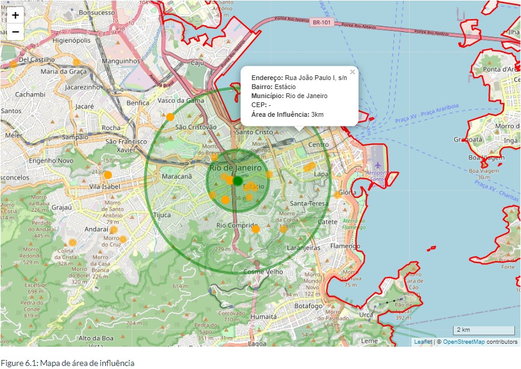
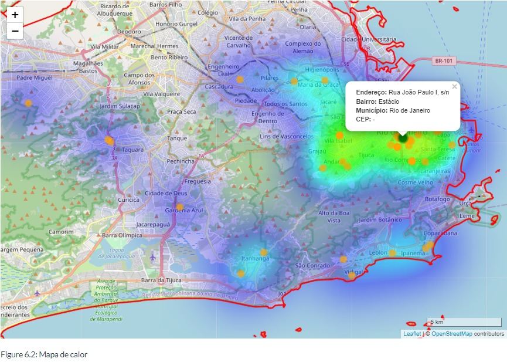

# Geomarketing na prática

Esse estudo é baseado na live Geomarketing na prática, do dia 24/01/2023, feita pelo Daniel Andrade.

Os dados fictícios foram fornecidos durante a live. É um estudo que busca identificar onde estão localizados os potenciais clientes de uma pizzaria no município do Rio de Janeiro.

O link para acesso é esse <https://rpubs.com/leonardofwink/geomarketing-na-pratica>.

Alguns desafios são apresentados durante o desenvolvimento do estudo, como trabalhar com diferentes formatos de arquivos. Aqui utilizei as extensões `.csv`, `.gpkg`, `.shp` e `.kml`.

Além disso, esse projeto é uma maneira de me desafiar. Enquanto o Daniel desenvolveu a análise utilizando o `QGIS`, eu busquei adaptar a mesma lógica dele, mas utilizando o `R`. Também procurei otimizar algumas etapas, principalmente no tratamento das planilhas.

Fiquei bem contente em conseguir gerar mapas interativos! Você pode dar zoom, arrastar para os lados e clicar nos pontos para saber mais informações a respeito. Nas imagens você pode encontrar o resultado final para o mapa de área de influência e para o mapa de calor.

Sintam-se à vontade para mandar contribuições, são sempre muito bem-vindas!

Obrigado!

